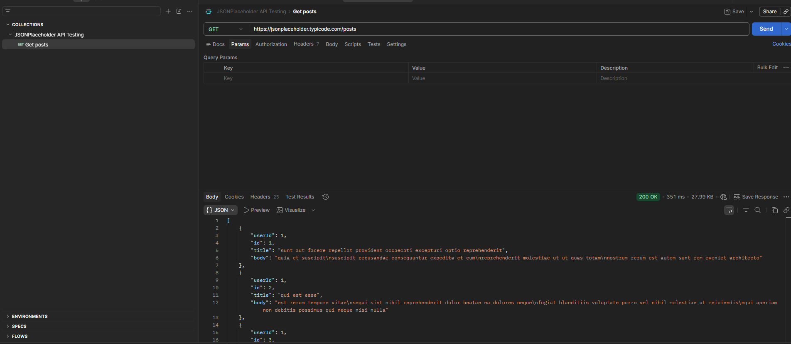
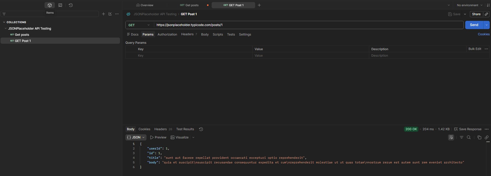
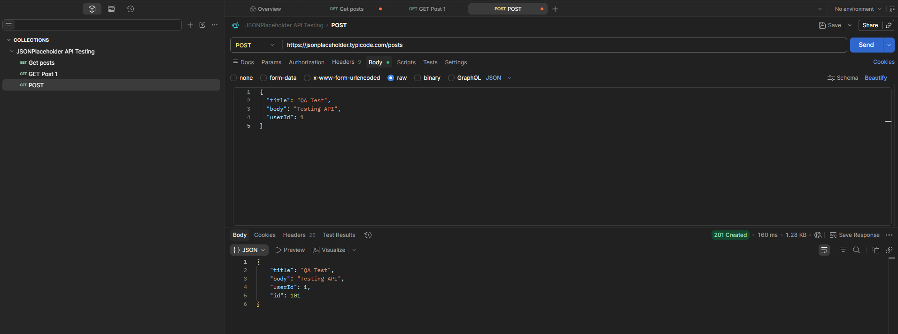
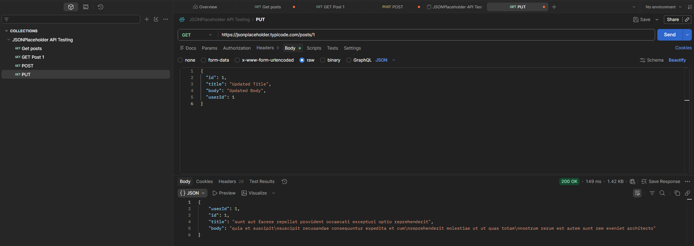
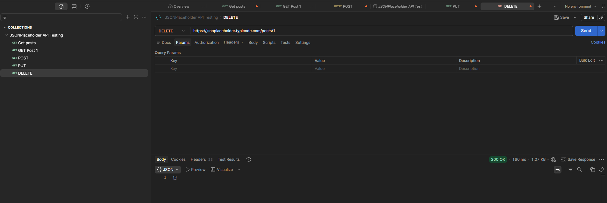

# API Testing Project

## Objective

Validate REST API endpoints using functional testing techniques.

## Scope

The project covers:

* GET requests
* POST requests
* PUT requests
* DELETE requests
* Response validation
* Status code verification

## Tools

* Postman
* JSONPlaceholder
* GitHub

## API Used

https://jsonplaceholder.typicode.com/

## Test Coverage

* Endpoint validation
* Response structure validation
* Status code verification
* CRUD operations testing

## Screenshots

### GET /posts

Objective:
Validate that the endpoint returns a successful response and a valid JSON payload.

Expected Result:
- Status Code: 200 OK
- Response Body: JSON array containing posts

Evidence:

### GET /users/1

 

### POST /posts

### PUT /posts/1

### DELETE /posts/1

## Execution Results

| Test ID | Endpoint | Method | Result |
|----------|----------|----------|----------|
| API-001 | /posts | GET | PASS |
| API-002 | /posts/1 | GET | PASS |
| API-003 | /posts | POST | PASS |
| API-004 | /posts/1 | PUT | PASS |
| API-005 | /posts/1 | DELETE | PASS |
